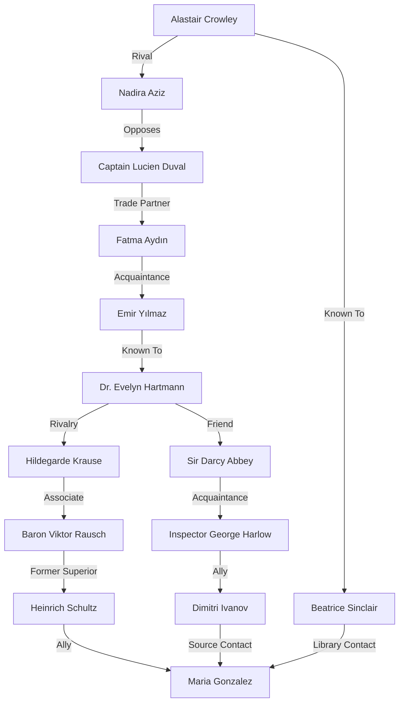

# Criando um Enredo de RPG Envolvente com GPT-4


Criar um cenário de RPG cativante requer uma mistura de imaginação, um forte senso de estrutura narrativa, e a capacidade de desenhar personagens e conflitos envolventes. Em uma virada moderna, podemos aproveitar o poder da IA, particularmente o [GPT-4](https://chat.openai.com), para ajudar neste esforço criativo. Este post revela como usar o GPT-4 na criação de um enredo de RPG envolvente, com foco na criação de um cenário situado em uma Europa sombria dos anos 1930, repleta de intrigas e horrores eldritch.

### Passo 1: Preparando o Palco

Primeiramente, é crucial ter um cenário claro em mente. Nosso exemplo é um RPG de investigação ambientado na década de 1930 com locais espalhados por Londres, Berlim e Istambul. O enredo principal gira em torno de uma maquinação sombria para convocar um Ancião, com um tom reminiscente do horror lovecraftiano.

Com isso em mente, abastecemos o GPT-4 com a seguinte instrução inicial:

```plaintext
Sua tarefa é me ajudar a criar material de apoio para um RPG de mesa. O cenário é uma investigação nos anos 1930 e os PCs são os investigadores. Os locais de interesse estão espalhados pela Europa, principalmente em Londres, Berlim e Istambul. O tom é sombrio, com vibrações cthulhianas. A trama principal é uma espécie de maquinação para trazer de volta um Ancião.
```

### Passo 2: Gerando Personagens Não-Jogadores (NPCs)

Criar NPCs convincentes é um pilar da narrativa interativa. O GPT-4 pode ser uma ferramenta poderosa na geração de personagens diversos com traços e objetivos distintos. Uma técnica conhecida como "One-shot Prompt" pode ser usada para guiar o modelo na geração de NPCs que se encaixem na narrativa e cenário do enredo. "One-shot prompt" significa que incluímos um exemplo do que gostaríamos que o GPT gerasse nas nossas instruções.

Aqui está a instrução para gerar dez NPCs, onde passamos um NPC exemplo:

```plaintext
Para começar, gere 10 NPCs seguindo o exemplo abaixo:

# Sir Darcy Abbey

Um espião aposentado em seus 60 anos. Ele é velho, mas ainda é bonito, educado, bem-humorado e um pouco estoico.

*O que ele pode fornecer?* - Ele ainda tem contatos e pode fornecer informações sobre o cenário underground, rumores e dicas de grandes movimentos políticos internacionais.

*Qual é o seu objetivo?* - Ele é um bom amigo de um dos PCs e quer ajudar. Ele não fala abertamente sobre ameaças sobrenaturais apesar de estar convencido da sua existência.
```

### Passo 3: Esculpindo Vilões

Toda boa história precisa de antagonistas. Aqui, foram criados três vilões distintos, cada um com metas malignas únicas, mas conflitantes. Isso pode criar uma paisagem narrativa rica, repleta de tensão e forças opostas.

```plaintext
Agora crie 3 vilões NPCs. Faça-os muito diferentes um do outro e com objetivos malignos, mas conflitantes.
```

### Passo 4: Tecendo Relacionamentos

Relacionamentos entre personagens adicionam profundidade à história. A rede de relacionamentos ajuda a criar uma teia de interações que podem ser exploradas durante o jogo. Aqui está um trecho de como uma rede de relacionamento foi estabelecida entre os NPCs:

```plaintext
Crie uma rede de relacionamento entre os NPCs. Cada um deve estar conectado a pelo menos 2 outros, mas não a mais de 4 outros.
```

### Passo 5: Visualizando a Rede

Visualizar a rede de relacionamentos pode ser uma referência útil tanto para o Mestre quanto para os jogadores. Ferramentas como [Mermaid](https://mermaid.js.org/) podem ser usadas para criar diagramas claros ilustrando as conexões entre os personagens.

```plaintext
Crie um diagrama Mermaid para essa rede.
```



### Passo 6: Desenvolvendo o Enredo

Com um elenco de personagens e seus relacionamentos estabelecidos, é hora de se aprofundar no enredo principal. O GPT-4 pode ajudar a esboçar pontos chave do enredo, desenvolver sub-tramas e criar desafios envolventes para os jogadores superarem.

### Conclusão

Embarcar neste esforço criativo com o GPT-4 abre um reino de possibilidades na narrativa de RPG. Se você é um Mestre experiente ou está apenas começando, empregar a IA em seu kit de ferramentas narrativas pode levar a enredos de RPG vibrantes, complexos e envolventes prontos para cativar seus jogadores.

Nota: as imagens desse post também foram geradas pelo GPT-4 baseadas nas descrições dos NPCs. Tente descobrir quem é quem...

---

## Apêndice: o resultado


Aqui está o resultado gerado pelo GPT-4, incluindo objetos e lugares de interesse gerados após a rede de relacionamentos.

### NPCs

Esse foram os NPCs gerados pelo GPT-4. Muitos dos arquétipos são bem conhecidos enquanto outros são curiosos.

Suas motivações são pouco variadas devido ao foco do cenário e ao exemplo inicial de NPC ser alinhado a ele. Para uma maior variedade, crie uma motivação diferente para o NPC de exemplo ou forneça mais exemplos.

#### Dra. Evelyn Hartmann

Uma arqueóloga brilhante, porém excêntrica, na casa dos 40 anos, com vasto conhecimento sobre civilizações antigas e práticas ocultas.

*O que ela pode oferecer?* - Ela pode fornecer insights sobre relíquias antigas, textos e rituais relacionados aos Antigos.

*Qual é o seu objetivo?* - Impedir a maquinação e salvar a humanidade da iminente destruição, mas é curiosa sobre a extensão do conhecimento e poderes antigos.

#### Heinrich Schultz

Um ex-soldado na casa dos 30 anos, assombrado por suas experiências passadas na Grande Guerra. Ele é rústico, disciplinado, mas atormentado.

*O que ele pode oferecer?* - Suas habilidades militares e conhecimento sobre as redes subterrâneas em Berlim podem ser valiosos.

*Qual é o seu objetivo?* - Buscar redenção por seus atos passados e frustrar as forças malignas que ameaçam o mundo.

#### Fatma Aydın

Uma comerciante turca astuta na casa dos 30 anos, com conexões em mercados legais e ilegais em Istambul.

*O que ela pode oferecer?* - Acesso a itens raros e exóticos, e conhecimento sobre os lugares e pessoas escondidos da cidade.

*Qual é o seu objetivo?* - Proteger sua cidade e seu patrimônio das forças obscuras operando por trás das cortinas de Istambul.

#### Inspetor George Harlow

Um inspetor britânico experiente na casa dos 50 anos, meticuloso, com um olhar atento para detalhes e uma vasta rede do lado da lei londrina.

*O que ele pode oferecer?* - Informações sobre investigações em andamento, registros criminais e acesso a alguns recursos da polícia.

*Qual é o seu objetivo?* - Manter a justiça e proteger Londres dos terrores invisíveis que se escondem nas sombras.

#### Hildegarde Krause

Uma condessa alemã misteriosa na casa dos 40 anos, elegante, bem-falada, mas com uma aura sinistra.

*O que ela pode oferecer?* - Acesso à alta sociedade e círculos políticos em Berlim, possivelmente abrigando segredos sombrios.

*Qual é o seu objetivo?* - Seus motivos são incertos, mas ela parece ter um interesse direto nos antigos poderes que estão sendo buscados.

#### Alastair Crowley

Um ocultista notório na casa dos 40 anos, enigmático, com vasto conhecimento do arcano e uma rede de indivíduos com ideias semelhantes.

*O que ele pode oferecer?* - Insights sobre o oculto, potenciais aliados (ou inimigos) dentro dos círculos esotéricos.

*Qual é o seu objetivo?* - Sua natureza enigmática esconde suas verdadeiras intenções, que podem ser obscuras ou podem se alinhar com os PCs por seus próprios motivos.

#### Maria Gonzalez

Uma jornalista espanhola ardente na casa dos 20 anos, corajosa, com talento para se meter e sair de encrencas.

*O que ela pode oferecer?* - Informações coletadas de suas investigações, acesso a arquivos de jornais (lembre-se, não existe internet em 1930) e contatos em várias cidades.

*Qual é o seu objetivo?* - Expor a verdade por trás das maquinações, por mais sombria que seja, ao público.

#### Dimitri Ivanov

Um emigrante russo na casa dos 40 anos, desencantado com o regime bolchevique, vivendo em Londres e trabalhando como investigador particular.

*O que ele pode oferecer?* - Habilidades investigativas, conhecimento da comunidade expatriada russa e um desprezo pelo totalitarismo que pode impulsionar suas ações.

*Qual é o seu objetivo?* - Uma vingança pessoal contra aqueles que servem forças obscuras, visando desmantelar seus planos.

#### Emir Yılmaz

Um historiador turco na casa dos 30 anos, quieto, introvertido, com vasto conhecimento das histórias ocultas do Império Otomano.

*O que ele pode oferecer?* - Conhecimento sobre locais antigos, textos e passagens esquecidas da cidade que podem ser cruciais em Istambul.

*Qual é o seu objetivo?* - Proteger o mundo dos horrores do passado que estão ressurgindo.

#### Beatrice Sinclair

Uma bibliotecária inglesa na casa dos 20 anos, tímida, bondosa, com uma coragem inesperada e conhecimento sobre uma vasta gama de tópicos.

*O que ela pode oferecer?* - Acesso a livros raros, manuscritos e uma rede de acadêmicos que poderiam ajudar na investigação.

*Qual é o seu objetivo?* - Ajudar os PCs a prevenir o despertar do Antigo, movida por um senso de dever e coragem recém-descoberta.


### Os vilões 

Os vilões ficaram particularmente interessantes. Note que o formato "objetivo - modo de operação - conflito" foi definido pelo GPT-4 por conta própria, eu havia pedido apenas por vilões diferentes e com objetivos conflitantes.

Gostei tanto do formato que pretendo reutilizá-lo em outros jogos.

#### Barão Viktor Rausch

Um aristocrata alemão sinistro na casa dos 50 anos, frio, calculista e obcecado por ganhar poder.

*Qual é o seu objetivo maligno?* - Ele pretende aproveitar o poder do Antigo para controlar a Alemanha e depois a Europa, acreditando que pode comandar a entidade antiga.

*Como ele opera?* - Utilizando sua riqueza e conexões políticas, ele financia cultos obscuros e expedições arqueológicas para desenterrar relíquias e conhecimentos proibidos.

*Conflito com outros vilões?* - Despreza o caos e busca minar outros vilões que visam à destruição ou têm objetivos que ameaçam seu controle.

#### Nadira Aziz

Uma feiticeira egípcia enigmática na casa dos 30 anos, carismática, manipuladora, com um desejo fanático de despertar o Antigo.

*Qual é o seu objetivo maligno?* - Ela acredita em cumprir uma profecia antiga para liberar o Antigo e purificar o mundo de seres indignos.

*Como ela opera?* - Através de seu culto e domínio da magia negra, ela manipula outros para fazer sua vontade, infiltrando-se em organizações-chave para promover sua causa.

*Conflito com outros vilões?* - Vê o desejo de controle do Barão Rausch como um patético mal-entendido do verdadeiro poder do Antigo e uma ameaça à sua visão apocalíptica.

#### Capitão Lucien Duval

Um caçador de tesouros francês renegado na casa dos 40 anos, implacável, oportunista, movido pela ganância e pelo fascínio do desconhecido.

*Qual é o seu objetivo maligno?* - Obter relíquias e conhecimentos antigos ligados ao Antigo, vendendo-os ao maior licitante, independentemente das consequências.

*Como ele opera?* - Através de uma rede de mercenários e conexões no mercado negro, ele busca e adquire artefatos proibidos, muitas vezes deixando um rastro de destruição por onde passa.

*Conflito com outros vilões?* - Sua natureza mercenária e falta de motivação ideológica o colocam em conflito com o Barão Rausch e Nadira Aziz, pois ele está disposto a vender para qualquer um, potencialmente minando seus planos.
